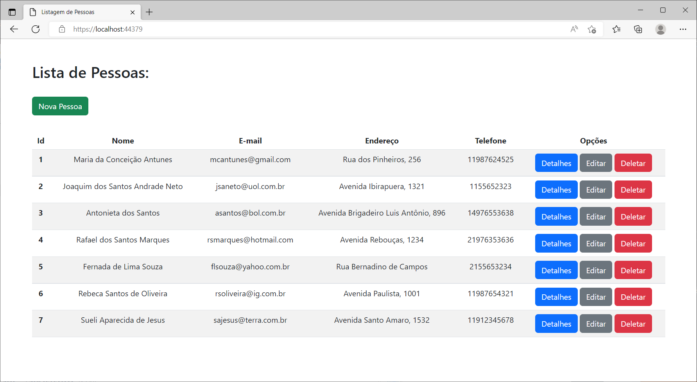
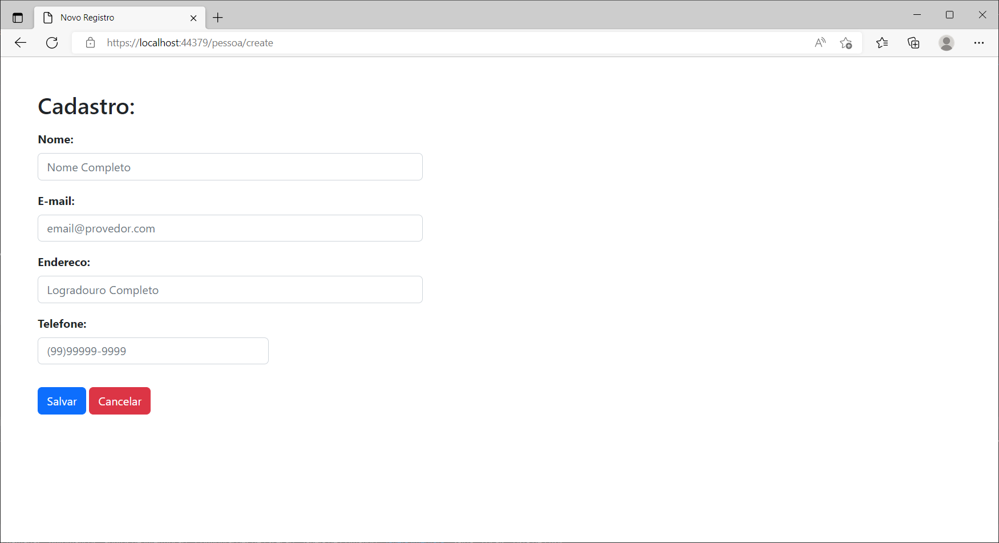
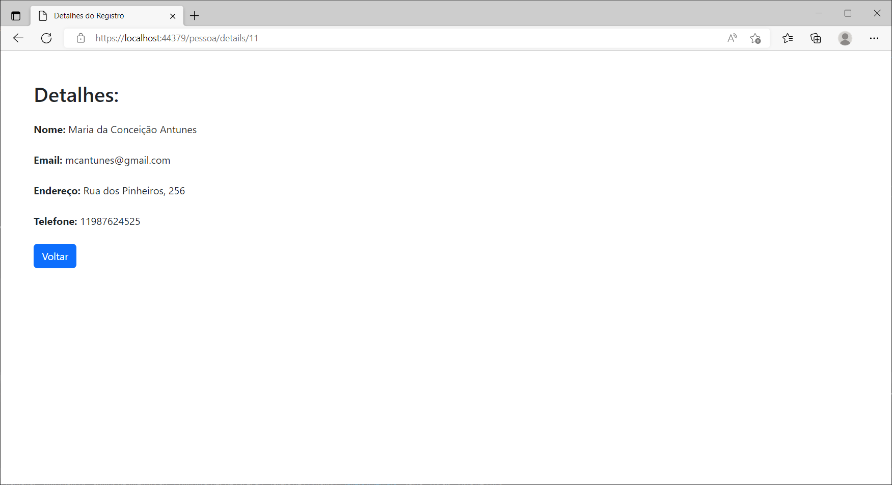
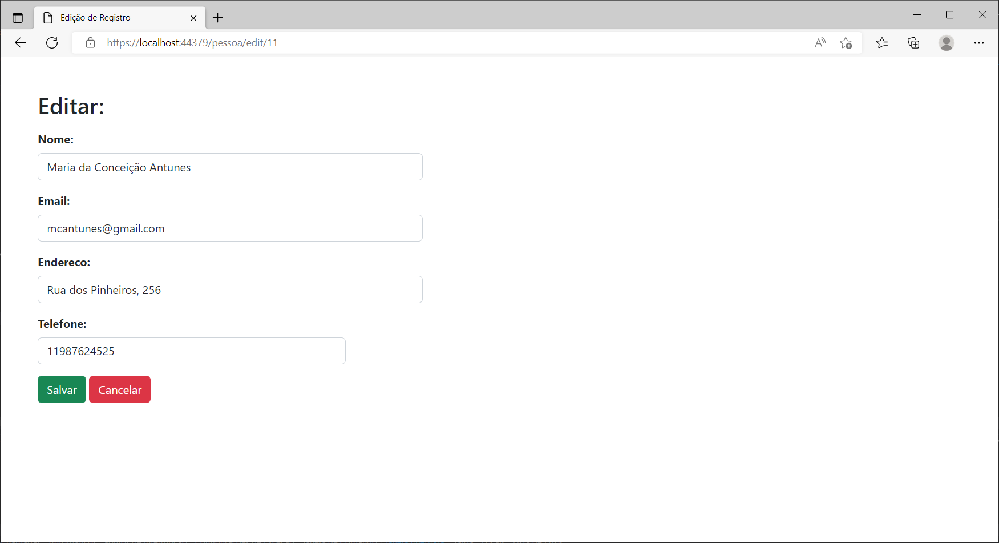
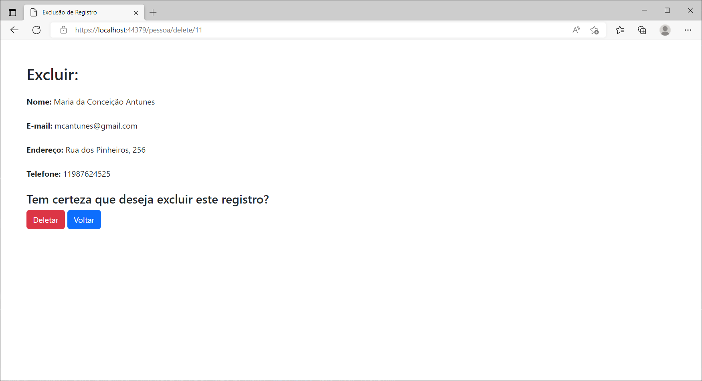
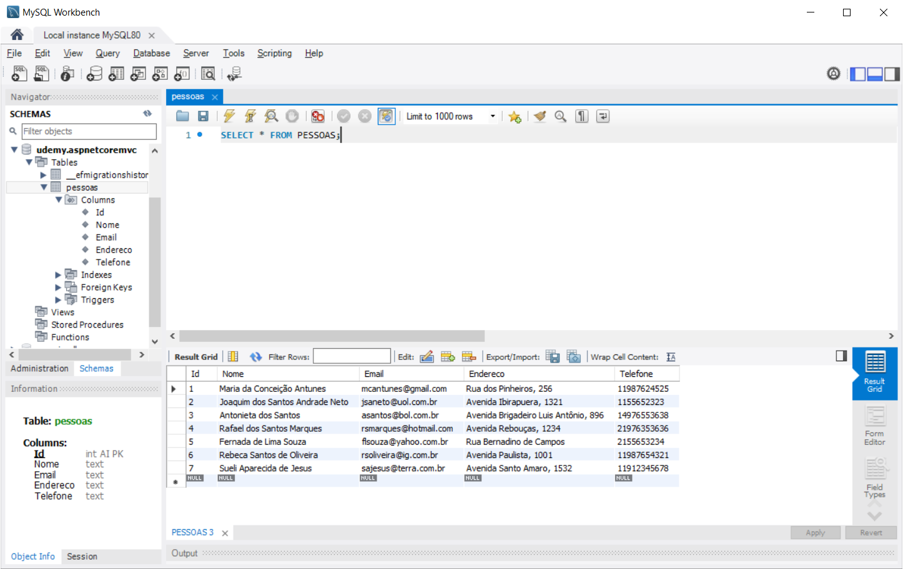

# Software desenvolvido com base no curso Asp Net MVC com Mysql. #

Projeto iniciado a partir do Template vazio do Asp Net Core, criei a Arquitetura MVC (Model-View-Controller), utilizei a estratégia Code First para a criação do Banco de Dados no MySQL partindo das classes de Modelo e executando as Migrações  do EntityFramework, criei a configuração da String de Conexão no arquivo Appsettings.json, fiz a injeção de dependência no arquivo startup.cs e consegui realizar as operações do CRUD (Create-Read-Update-Delete).

Utilizei o Framework Bootstrap para estilização das páginas e para evitar inconsistências no Banco de Dados, criei algumas verificações no HTML da página de cadastro, como o "Required", "MaxLenght", "MinLenght" e para auxílio do usuário, Placeholders e Tooltips.

### Página de Listagem de Registros: ###

### Página de Cadastro: ###

### Página de Detalhes: ###

### Página de Edição: ###

### Página de Deleção: ###

### Banco De Dados MySQL ###
